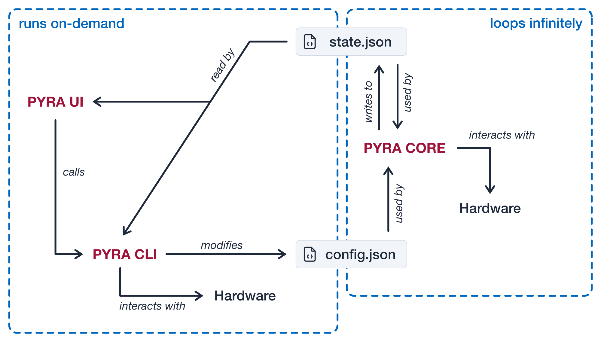
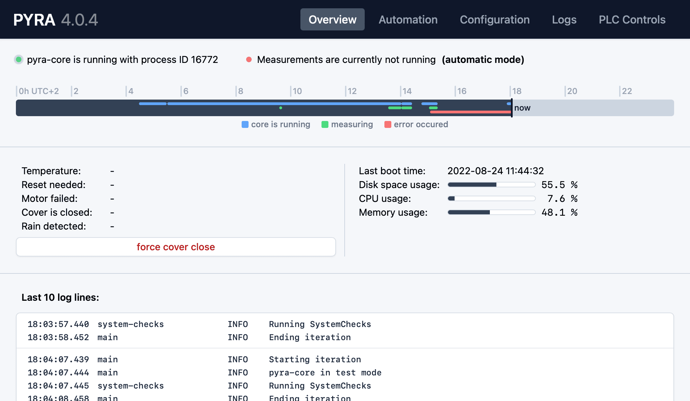

# Statement of need

Global warming, caused by anthropogenic greenhouse gas (GHG) emissions is an inevitable thread [@IPCC2021]. To promote global climate change mitigation policies, a profound GHG observational data basis is required to understand and quantify the sources and sinks of GHG emissions. Ground-based remote sensing instruments that analyze direct sunlight using, for example, EM27/SUN Fourier transform spectrometers [@gisi2011camtracker] fill the gap between ground-based in situ measurements and space-based measurements by satellites [@hase2015application;@rissmann2022gradients]. Due to its dependency on direct sunlight and clear skies, the EM27/SUN generally requires a trained operator on site. Depending on the weather conditions, the operator needs to manually control the instrument and measurement times. This is time and cost-intensive, in particular, if more than one instrument is involved. However, state-of-the-art EM27/SUN networks consist of up to 6 instruments to estimate the emissions of cities [@jones2020assessing;@dietrich2021muccnet;@tu2022madridwastedisposal;@hase2015application;@ionov2021stpetersburg;@che2022lagrangian;@vogel2019paris] or local and regional GHG sources [@chen2020oktoberfest;@luther2022observational;@tu2020intercomparison;@toja2017cfdco2dispersion;@chen2016differentialcolumn;@tu2022madridwastedisposal;@klappenbach2022sanfran]. These setups generally require at least one operator to be on-site for each instrument.
_Pyra_ is an automation software that does not require an on-site operator and enables the user to operationally measure GHGs with a workload limited to system monitoring. This also guarantees continuous measurements during weekends, holidays, and at remote locations resulting in an optimized data yield while saving time and human resources. _Pyra_'s open-source code and documentation will reduce operator training efforts.

The COllaborative Carbon Column Observing Network [@frey2019coccon] community comprises 19 institutions operating over 70 EM27/SUN in Germany, France, Spain, Finland, Romania, USA, Canada, UK, India, Korea, Botswana, Japan, China, Mexico, Brazil, Australia, and New Zealand [@tu2022madridwastedisposal]. Previous studies show the versatile deployment options of the instruments around the world [@klappenbach2015vessel;@alberti2022calibrationcoccon;@viatte2017methanedairyfarm;@butz2022versatile;@luther2019coalminesmobile;@knapp2021shipborne;@butz2017etna;@kille2019colorado;@hedelius2016retrievalerrors;@kille2019colorado;@velazco2019australia]. Since no consistent automatization software exists, _Pyra_, as an open-source automation, will potentially unify the measurement procedure and facilitate data acquisition.

Previous versions of _Pyra_ were successfully operated during measurement campaigns [@forstmaier2022hamburg;@humpage2021uganda] and continuous GHG observations [@tu2020intercomparison;@dietrich2021muccnet]. Due to the closed-source nature of these versions, users are dependent on software and hardware support from TUM. To make _Pyra_ a useful tool for the growing community we entangled it from the dependency on TUM hardware [@heinle2018enclosure;@dietrich2021muccnet] and reworked the codebase architecture to allow for easier integration of new features.

# Summary

_Pyra_ consists of three different parts (\autoref{fig:Architecture}): _Pyra Core_ (continuous background process), _Pyra Command Line Interface (Pyra CLI)_, and _Pyra User Interface (Pyra UI)_ (both are used for on-demand user interaction with _Pyra Core_).

{ width=100% }

## Pyra Core

_Pyra Core_ is implemented as a continuous main loop that manages measurements based on prevalent weather conditions. Before every loop, it reads the latest version of the configuration file `config.json` and adapts accordingly. _Pyra Core_ is designed to run 24/7 and handle runtime exceptions without human interaction.

_Pyra Core_ allows for three different operation modes: Manual, Automatic, and CLI. In Manual mode, the user has full control over whether measurements should be active. The user-controlled state can be updated within the _Pyra UI_. In Automatic mode, three different triggers are considered: Sun Elevation, Time, and Helios. Helios evaluates direct sunlight by analyzing the sharpness of shadow edges created by an external setup precisely designed for this application [@dietrich2021muccnet]. The user can select which of these triggers are to be considered. Measurements are only set to be running if all selected triggers are fulfilled. In CLI mode, triggers from external sources can be considered. This option is aimed at teams that use custom-built systems or sensors not part of Pyra and TUM hardware.

In the continuous loop, _Pyra Core_ will run a sequence of modules that operate the individual components required to perform EM27/SUN measurements autonomously: _EnclosureControl_, _OPUSMeasurements_, _SunTracking_, and _SystemChecks_.

_EnclosureControl_ operates the custom TUM weather protection enclosure [@heinle2018enclosure;@dietrich2021muccnet]. Without a respective enclosure, this module can be skipped. The module communicates with the enclosure's built-in Siemens S7 PLC and powers down the spectrometer at dusk to extend the overall spectrometer lifetime. At dawn, it powers up the spectrometer again. Based on the previously described measurement triggers the module will open and close the cover. Protecting the instrument from bad weather conditions is always prioritized over performing measurements.

_OPUSMeasurements_ manages the FTIR spectrometer measurement software OPUS. It communicates with OPUS via a Dynamic Data Exchange (DDE) connection. During the day OPUS is kept up and running. During the night OPUS is shut down to reset after a full day of measurements.

_SunTracking_ operates the CamTracker software which controls the mirrors of the EM27/SUN. By controlling two motors these mirrors are in sync with the current sun position to ensure sunlight is directed into the instrument. During CamTrackers operation _Pyra Core_ will monitor the difference between motor positions and calculated sun position in azimuth and elevation. Whenever the motor offset reaches a certain threshold the CamTracker software will be reinitialized by _Pyra_.

Finally, _SystemChecks_ monitors important OS parameters (i.e. CPU, memory, disk space, power supply) and raises exceptions on certain thresholds.

Whenever exceptions occur or are resolved in any part of _Pyra Core_, a list of operators will be notified via email.

Since the measurement data will be post-processed and used on other machines, _Pyra Core_ includes an upload client that allows uploading interferograms (produced by the EM27/SUN) and other auxiliary data using SSH while ensuring full data integrity. The upload client runs in parallel to the measurement procedures.

## Pyra CLI

_Pyra CLI_ is designed to offer a text-based interface, which allows full control over _Pyra Core_ without the need for a graphical user interface. Switching to CLI mode enables different teams of the community to easily integrate Pyra into their existing hardware solutions and keep their custom control logic for measurements. It is possible to temporarily disable external CLI-based measurement decisions by switching back to Manual mode.

The CLI is structured into different command groups (config, core, logs, plc, state). The config commands can read and write the `config.json` file and validate its structural integrity before updating to a new configuration, while the state commands read the latest content of `state.json`. The core commands allow to directly interact with the _Pyra Core_ process and manage that only one instance of the _Pyra Core_ process is running at the same time. The PLC commands interact with the integrated sensors and actors inside the TUM enclosures.

_Pyra CLI_ is also integrated into _Pyra UI_ and handles communication between the graphical user interface and _Pyra Core_. 

## Pyra UI

_Pyra UI_ provides a graphical user interface (\autoref{fig:UI}) to interact with _Pyra Core_. In the background, _Pyra CLI_ sends commands and reads the state- and log files from the file system.

In the Overview tab, a collection of relevant information is presented for a quick check on Pyra's activity. In the Automation tab, the different measurement modes (Manual, Automation, and CLI) can be selected and _Pyra Core_ can be started or stopped. The Configuration tab is used to edit the configuration parameters. Since the CLI is used for config updates, all updated parameter values will be validated and the validation result shown in the UI. In the Logs tab, the stream of log lines from _Pyra Core_ is displayed. Debug log lines can be hidden and the updates can be paused for a detailed analysis. If TUM hardware is enabled in the configuration there is an additional PLC Controls tab. By default, _Pyra Core_ has full control over the enclosure. If required the user can take over control and interact with the PLC directly. Examples of manual interaction are adjusting the cover position or toggling power relays.

{ width=100% }

# Software Dependencies

The _Pyra_ codebase consists of three software stacks: The Core and the CLI are written in Python[^3] and the UI is written in TypeScript[^1]. The documentation is written in Markdown and rendered as HTML using Docusaurus[^2].

For _Pyra Core_ and _Pyra CLI_, we are using Python 3.10 and Python Poetry[^4] as the dependency management tool. All Python libraries in use can be found in the `pyproject.toml` file. Tests can be run using pytest[^5]. The whole codebase has static type annotations which can be checked using MyPy[^6]. In addition to that, we are reusing the static type annotations to validate the JSON files loaded from the location file system with pydantic[^16].

_Pyra UI_ is written in HTML/CSS and TypeScript using the ReactJS framework[^7] and TailwindCSS[^8]. We are using Vite[^9] as a build tool and Tauri[^10] to bundle the web-based UI into a Windows 10 application. The libraries used by the UI codebase can be found in `packages/ui/package.json`.

The _Pyra Setup Tool_ depends on Git[^11] and the GitHub CLI[^12] and also comes with a `pyproject.toml` file. _Pyra_ itself communicates with OPUS and CamTracker[^13].

# Author Contributions

PA worked on the concept, architecture, and implementation of the original _Pyra_ software; PA coordinated the development of _Pyra 4_; PA and MM developed the architecture of _Pyra 4_; PA and MM implemented _Pyra Core_ and integrated it on all MUCCnet stations; MM developed _Pyra CLI_ and _Pyra UI_; MM developed _Pyra_'s DevOps concept and wrote its documentation website; AL helped with beta testing and gave feedback on _Pyra_ alpha and beta versions as the operator of MUCCnet; JC and FD designed the concept of an autonomously operating EM27/SUN network; JC initialized the development of this software; JC, FD and AL helped with their expertise in working with EM27/SUN spectrometers; PA, MM, and AL wrote the manuscript; JC and FD edited the manuscript.

# Acknowledgment of any financial support

This research has been supported by the Deutsche Forschungsgemeinschaft (DFG, German Research Foundation) (grant nos. CH 1792/2-1, INST 95/1544, PI: Jia Chen).

# References

[^1]: https://www.typescriptlang.org/
[^2]: https://docusaurus.io/
[^3]: https://www.python.org/
[^4]: https://python-poetry.org/
[^5]: https://github.com/pytest-dev/pytest/
[^6]: https://github.com/python/mypy
[^7]: https://reactjs.org/
[^8]: https://tailwindcss.com/
[^9]: https://vitejs.dev/
[^10]: https://tauri.studio/
[^11]: https://git-scm.com/
[^12]: https://cli.github.com/
[^13]: https://www.bruker.com/en/products-and-solutions/infrared-and-raman/remote-sensing/em27-sun-solar-absorption-spectrometer.html
[^16]: https://github.com/pydantic/pydantic

