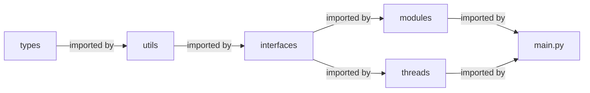

# Architecture

**The hierarchy between the three parts of Pyra:**

**Inside Pyra Core's main loop:**

-   The Core will infinitely loop over the modules `MeasurementConditions`, `EnclosureControl`, `SunTracking`, `OpusMeasurements`, and `SystemChecks`
-   The Core will start the Upload- and Helios-Thread when they should be running but are not
-   The threads will stop themselves based on the config

**The communication via the `state.json` file:**

 
 

## Pyre Core Directory structure

### Responsibilities

-   `types` contains all types used in the codebase. The whole codebase contains static type hints. A static-type analysis can be done using MyPy (see `scripts/`).
-   `utils` contains all supporting functionality used in one or more places.
-   `interfaces` includes the "low-level" code to interact with the PLC, the operating system, and the config- and state files.
-   `modules` contains the different steps that Pyra Core runs sequentially on the main thread.
-   `threads` contains the logic that Pyra Core runs in parallel to the main thread.

### Import hierarchy

_\* the graph is transient_
