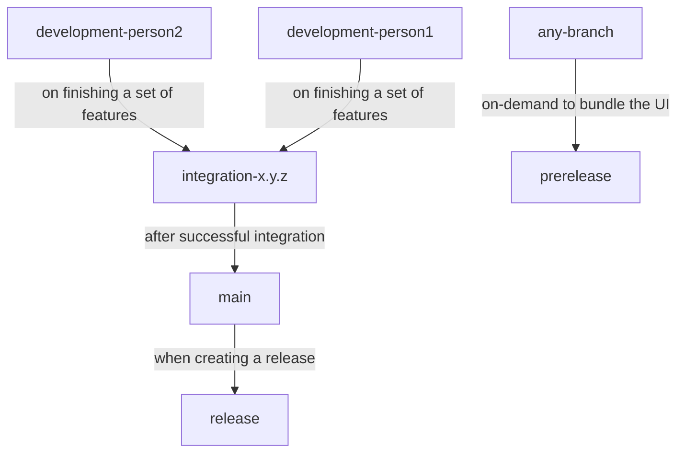

# Repository Organization

## Directory Structure

```
📁 .github                           (contains github actions workflows)

📁 config                            (configuration parameters used by pyra core)
    📄 config.json                       (not in the repository, used by pyra core)
    📄 config.default.json               (template)
    📄 helios.config.default.json        (template)
    📄 tum_plc.config.default.json       (template)
    📄 upload.config.default.json        (template)

📁 logs                              (logs and other output that pyra core produces)
    📄 info.log                          (log lines from the last 60 minutes)
    📄 debug.log                         (log lines from the last 60 minutes)
    📁 archive                           (daily log files for all older log lines)
    📁 activity                          (activity logs, jsons, only major events)
    📁 helios                            (images generated by helios)
    📁 helios-autoexposure               (images from helios' autoexposure routine)

📁 packages                          (contains the code for pyra core, cli, and ui)
    📁 core                              (entry point is "main.py")
    📁 cli                               (entry point is "main.py")
    📁 ui                                (project structure based on Tauri and Vite)
    📁 docs                              (documentation generated with docusaurus)

📁 runtime-data                      (where pyra core will put temporary data)

📁 scripts                           (scripts for manual things)
    📄 get_upload_dir_checksum.py        (calculate an upload dir checksum)
    📄 run_type_analysis.py              (run mypy on core and cli)
    📄 sync_version_numbers.py           (sync version number in all locations)

📁 tests                             (tests which can be run using pytest)
    📁 cli                               (can be run in a ci environment)
    📁 integration                       (can only be run on working em27 systems)
    📁 repository                        (can be run in a ci environment)
```

## Branch Structure

**Branches:** `development-...`, `integration-x.y.z`, `main`, `release`, `prerelease`

**Hierarchy:**

-   `development-...` contains stuff in active development and will be merged into `integration-x.y.z`.
-   `integration-x.y.z` is used during active station integration and will be merged into `main`.
-   `main` contains the latest running version that passed the integration and will be merged into `release` once enough changes have accumulated. Any branch can be released into `prerelease` to run the CI-Pipeline on demand.
-   `prerelease` will not be merged into anything else and is just used for development.



## Issues and Releases

Things we work on are managed via issues - bundled into milestones (each milestone represents a release). The issues should be closed once they are on the `main` branch via commit messages or pull requests ("closes #87", "fixes #70", etc. see [this list of keywords](https://docs.github.com/en/issues/tracking-your-work-with-issues/linking-a-pull-request-to-an-issue#linking-a-pull-request-to-an-issue-using-a-keyword)).

**Issue Labels:**

-   <span className='tw-bg-gray-200 tw-text-gray-700 tw-px-1.5 tw-py-0.5 tw-rounded tw-font-mono tw-text-sm tw-font-bold'>
        backlog
    </span>
    : Issues that are not urgent (feature ideas, improvements, etc.)
-   <span className='tw-bg-blue-200 tw-text-blue-700 tw-px-1.5 tw-py-0.5 tw-rounded tw-font-mono tw-text-sm tw-font-bold'>
        status:...
    </span>
    : Used to indicate an issue's progress
-   <span className='tw-bg-green-200 tw-text-green-700 tw-px-1.5 tw-py-0.5 tw-rounded tw-font-mono tw-text-sm tw-font-bold'>
        scope:...
    </span>
    : Used to indicate an issue's area of work
-   <span className='tw-bg-red-200 tw-text-red-700 tw-px-1.5 tw-py-0.5 tw-rounded tw-font-mono tw-text-sm tw-font-bold'>
        type:...
    </span>
    : Used to indicate an issue's type of work

Planned releases are described on [GitHub](https://github.com/tum-esm/pyra/milestones).

:::info

We integrate new releases on two different machines. When the new software runs smoothly for some time, we make it an official release.

:::

## Version numbers

Versions up to 4.0.4 are alpha and beta versions that should not be used regularly. Pyra can be generally used starting from version 4.0.5.

Inside the codebase, the version number is included 3 times: `pyproject.toml`, `packages/ui/package.json`, `packages/ui/src-tauri/tauri.conf.json`. The script `scripts/sync_version_numbers.py` takes the version number from the `.toml` file and pastes it into the other locations. This script can be run in a [git-hook](https://git-scm.com/book/en/v2/Customizing-Git-Git-Hooks).
