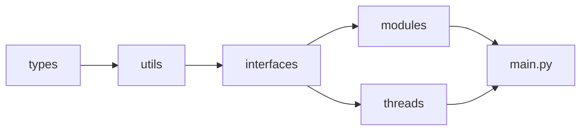

# Architecture

TODO: Architecture drawings

## Pyre Core Directory structure

### Responsibilities

`types` contains all types used in the codebase. The whole codebase contains static type hints. A static type analysis can be done using `mypy` (see `scripts/`).

`utils` contains all supporting functionality used in one or more places.

`interfaces` includes the "low-level" code to interact with the PLC, the operating system, and the config- and state-files.

`modules` contains the different steps that PYRA Core runs sequentially on the main thread.

`threads` contains the logic that PYRA Core runs in parallel to the main thread.

### Import hierarchy

-   `types` doesn't import any other code from PYRA Core
-   `utils` can import `types`
-   `interfaces` can import `types` and `utils`
-   `modules` and `threads` can import `interfaces`, `types`, and `utils`
-   `main.py` can import all of the above

_\* the graph is transient_
